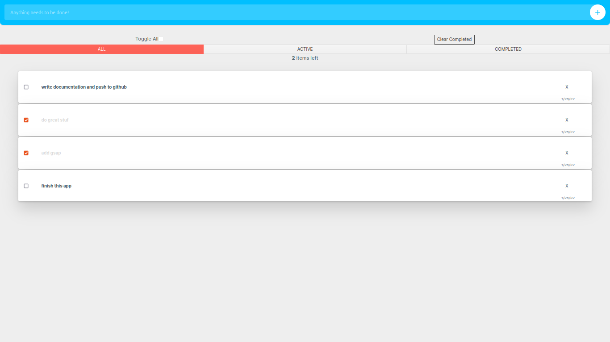

*this repo is more for myself, my first angular app :)
# Angular Todo Example with rx and gsap



## Tech/framework used

- Angular 13.1.0
- RxJS 7.5.2
- GSAP 3.9.1

This project was generated with [Angular CLI](https://github.com/angular/angular-cli) version 13.1.4.

## Installing / Getting started and important commands

Run `yarn` to install dependencies.

Run `ng serve` for a dev server. Navigate to `http://localhost:4200/`. The app will automatically reload if you change any of the source files.

Run `ng build` to build the project. The build artifacts will be stored in the `dist/` directory.

Run `ng test` to execute the unit tests via [Karma](https://karma-runner.github.io).

Run `ng e2e` to execute the end-to-end tests via a platform of your choice. To use this command, you need to first add a package that implements end-to-end testing capabilities.

To get more help on the Angular CLI use `ng help` or go check out the [Angular CLI Overview and Command Reference](https://angular.io/cli) page.

## Features

### What's all the bells and whistles this little bad boy can perform?

* Most important take your todos and show it in a friendly way to monitor progress.
* Inspired by [angular-rx-todos](https://github.com/RxJS-CN/angular-rxjs-todos) todos.service based on rx BehaviorSubject:

```
  type TodosOperation = (todos: Todo[]) => Todo[];
  
.
.
.

  todos$: Observable<Todo[]>;
  update$ = new BehaviorSubject<TodosOperation>((todos: Todo[]) => todos);
  
.
.
.

  this.todos$ = this.update$.pipe(
    scan<TodosOperation, Todo[]>(
      (todos, operation) => operation(todos),
      initialTodos
    ),
    tap((todos) =>
      this.logger(
        `tap: ${JSON.stringify(todos.map(({ description }) => description))}`
      )
    ),
    share<Todo[]>({
      connector: () => new ReplaySubject(1),
      resetOnError: false,
      resetOnComplete: false,
      resetOnRefCountZero: false,
    })
  );

  getAllTodos = (): Observable<Todo[]> => {
    this.logger(`TodoService: getting todos`);
    return this.todos$;
  };

```

and in the component is used so:

```
  private componentDestroyed$: Subject<boolean> = new Subject();


  todos: Todo[] = [];
    ngOnInit(): void {
    this.todosSubscription = this.todoServ
      .getAllTodos()
      .pipe(
        combineLatestWith(this.currentFilter),
        takeUntil(this.componentDestroyed$)
      )
      .subscribe(([todos, currentFilter]) => {
        this.todos = todos;
        this.hasCount = !!todos.length;
        this.hasCompleted = !!todos.filter(({ completed }) => completed).length;
        this.remainintCount = todos.filter(
          ({ completed }) => !completed
        ).length;
        this.isAllCompleted =
          todos.length === todos.filter(({ completed }) => completed).length;
        this.filterTodos(currentFilter as Filter);
      });
  }

 ngOnDestroy(): void {
    this.componentDestroyed$.next(true);
    this.componentDestroyed$.complete();
  }

```

_the use of the componentDestroyed subject is a convenient way to make sure all subscription will be unsubscribed._

- custom directive using GSAP for a fadeIn and fadeOut touch:
 
 *_first create the core animation directive_

```
export class CoreAnimationDirective {
  @Input() duration = 1;
  @Input() delay = 0;

  @Output() complete: EventEmitter<null> = new EventEmitter();
  @Output() reverseComplete: EventEmitter<null> = new EventEmitter();

  protected timeline: gsap.core.Timeline;

  constructor(protected element: ElementRef) {
    this.timeline = gsap.timeline({
      onComplete: (_) => this.complete.emit(),
      onReverseComplete: (_) => this.reverseComplete.emit(),
      paused: true,
      reversed: true,
    });
  }

  protected animateIn() {
    if (this.timeline.isActive()) this.timeline.kill();

    this.timeline.play();
  }

  protected animateOut(parentViewRef: ViewContainerRef) {
    if (this.timeline.isActive()) this.timeline.kill();

    setTimeout(() => {
      this.timeline.timeScale(this.duration).delay(0).reverse();
      setTimeout((_: never) => {
        if (parentViewRef) parentViewRef.clear();
      }, this.duration * 1000);
    }, this.delay * 1000);
  }
}

```

*_then create any kind of effect on top of it_

```
@Directive({
  selector: '[fadeInAnimation]',
})
export class FadeInAnimationDirective
  extends CoreAnimationDirective
  implements OnInit
{
  constructor(protected override element: ElementRef) {
    super(element);
  }

  protected override animateIn() {
    this.timeline
      .from(
        this.element.nativeElement,
        { opacity: '0', ease: 'Expo.easeInOut' },
        this.delay
      )
      .duration(this.duration);
    super.animateIn();
  }
  ngOnInit() {
    // perform animation
    this.animateIn();
  }
}
```

- so it can be used conveniently:

```
<section *ngIf="visibleTodos.length">
  <ul class="todos">
    <todo
      *ngFor="let todo of visibleTodos"
      fadeInAnimation
      [todo]="todo"
      (handleToggle)="toggle($event)"
      (handleRemove)="remove($event)"
      (handleEdit)="update($event)"
      (click)="onSelect(todo)"
    >
    </todo>
  </ul>
</section>
```

## Contributing

- If you'd like to contribute, by all means fork the repository and use a feature branch.
- Pull requests are warmly welcome.
- There are few known bugs and some unintentional behaviors.

## Links

- Project homepage: https://github.com/odedindi/angularTodos
- Repository: git@github.com:odedindi/angularTodos.git
- Issue tracker: https://github.com/odedindi/angularTodos/issues
    #### I value the care and effort to improve the security and privacy of this project!
- In case of sensitive bugs like security vulnerabilities, please contact
    odedindi@gmail.com directly instead of using issue tracker.
    
## Licensing

The code in this project is licensed under MIT [license](https://github.com/odedindi/angularTodos/blob/main/LICENSE).
